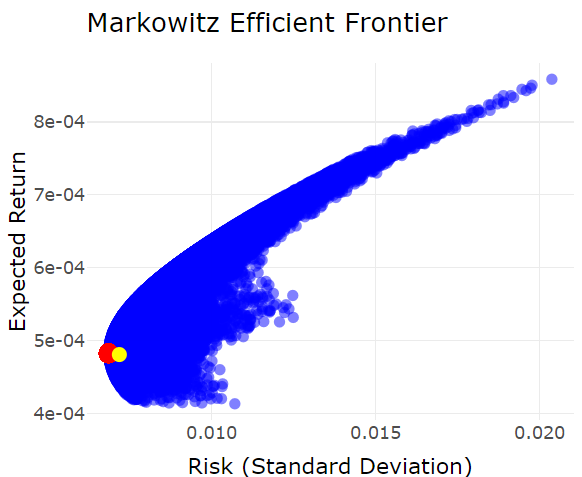

# Markowitz Efficient Frontier with R

This R project implements the Markowitz Efficient Frontier, allowing users to generate optimal portfolio allocations based on risk and return using historical asset price data.

## Introduction
The asset prices can be retrieved from sources like Google Sheets using the following command to fetch historical prices over the last 10 years:
```plaintext
=GOOGLEFINANCE("EPA:CW8"; "price"; TODAY()-365*10; TODAY(); "DAILY")
```

## Features
- **Calculate efficient frontiers** for a given set of assets
- **Identify minimum-risk portfolio allocations**
- **Visualize the efficient frontier** with interactive charts
- **Compare custom portfolio allocations** with the efficient frontier
- **Estimate future portfolio value** based on expected returns

## Requirements
- **To run the code, you need to install the following R packages:
```plaintext
install.packages("quadprog")
install.packages("ggplot2")
install.packages("plotly")
install.packages("readxl")
```

## Usage
- **Prepare your dataset as an Excel file with asset prices (columns) over time (rows).**
- **Update the file path in the script:**
```plaintext
prices = read_excel("path_to_your_file.xlsx")
```
- **Run the script to calculate the efficient frontier and visualize the results.**

## Example of Interactive Plot
- **The script generates an interactive plot of the efficient frontier, highlighting:**

- **The minimum-risk portfolio**
- **Custom portfolio allocation (entered by the user)**
- **The chart will display risk (standard deviation) on the X-axis and expected return on the Y-axis, with points representing portfolios. The minimum-risk portfolio is highlighted in red, and the user's current allocation can be added to the plot for comparison.**




## Output Example
- **Optimal Allocations: Displays the asset allocation for the minimum-risk portfolio.**
- **Future Value: Estimates the future value of a portfolio given a custom allocation over a specified time horizon.**

